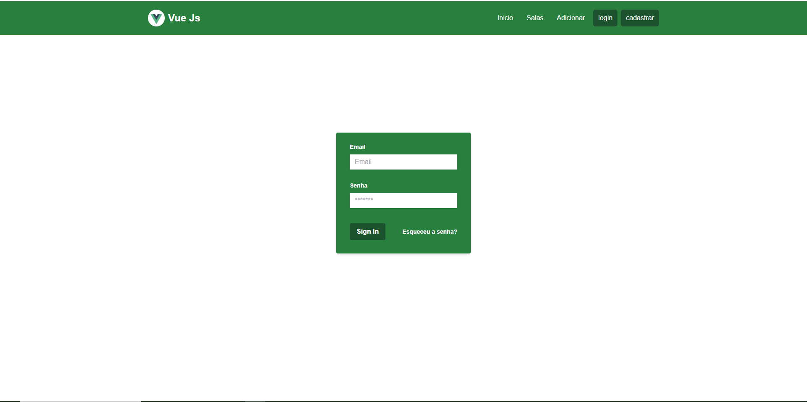
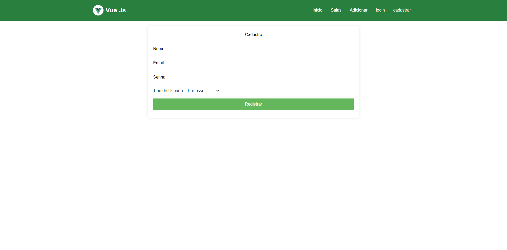
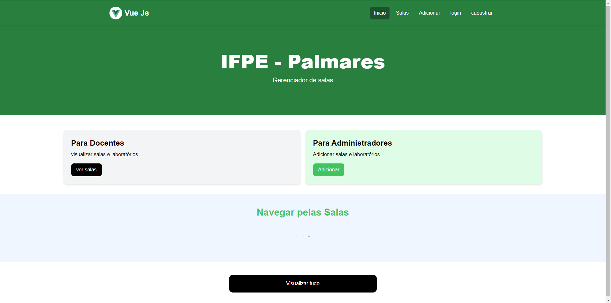
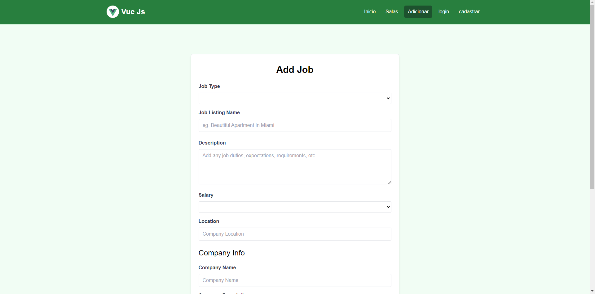
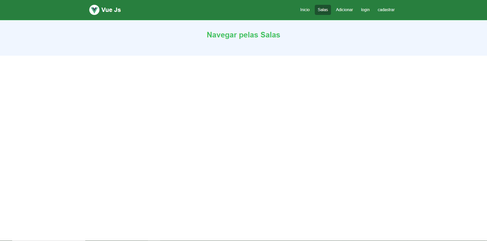

## Tela de Login

A página de login permite que os usuários se autentiquem no sistema.

## Tela de Cadastro

A página de cadastro permite adicionar novos usuários ao sistema.

## Página Inicial

A página inicial exibe uma lista de salas e laboratórios com seus respectivos status.

## Adicionar Salas e Laboratórios

Navegar pelas salas.